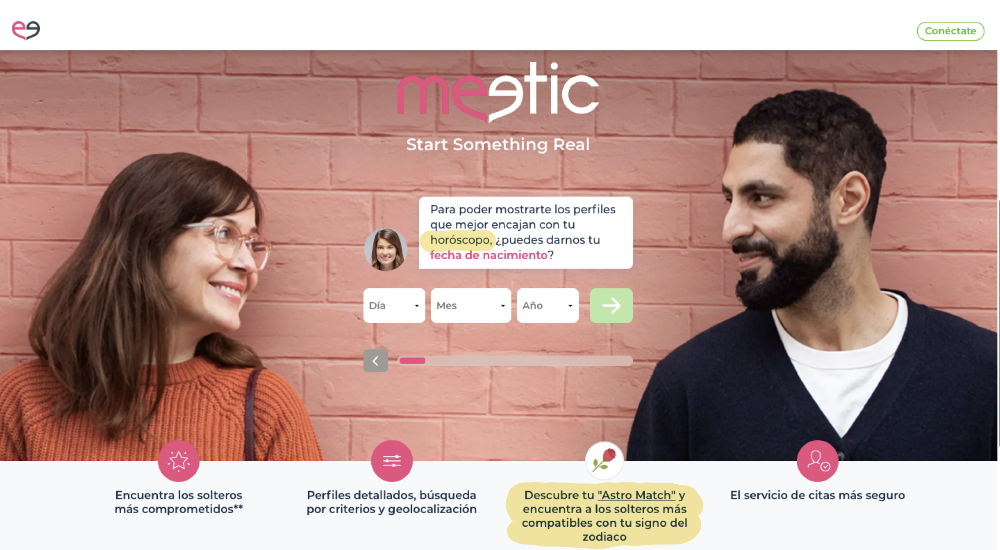
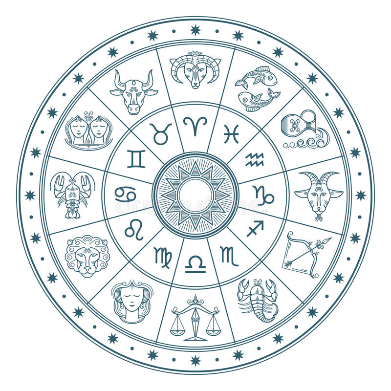

# Proyecto II: ♈︎ ♉︎ ♊︎ ♋︎ ♌︎ ♍︎ ♎︎ ♏︎ ♐︎ ♑︎ ♒︎ ♓︎

Ahora que trabajo para la plataforma de citas Meetic y ya de paso, que soy 'una soltera exigente', mi objetivo no es otro que el de aportar valor a la empresa, siempre respaldando mis propuestas de mejora con datos. Quizás, como recién llegada a la empresa, sea pronto para empezar a cuestionar las decisiones de mi nueva empresa pero tras haber investigado, creo firmemente que Meetic ha cometido un error estratégico importante. Me estoy refiriendo a la última incorporación a su página web: una sección que junta candidatos basandose en la compatibilidad de sus signos del zodiaco.

Bajo el supuesto de que todo el que acude a a Meetic busca encontrar el mejor 'match' posible, siendo este una relación amorosa estable, duradera y definitiva, entendemos que Meetic ofrece un mejor servicio a sus solteros cuanto más compatibles sean los candidatos que interconecta.
# 
Aunque existen ambas opiniones negativas y positivas hacia la fiabilidad de la astrología, no se puede negar que sus principios parten de fundamentos científicos. Tampoco puede negarse que una importante proporción de la población mundial, sobretodo comprendida en edades con mayor tendencia a 'buscar pareja', afirma creer en el horóscopo. El 30% de los adultos americanos cree en esta ciencia según https://www.livingfacts.org/ .

La compatibilidad amorosa sostenida por la astrología funciona de la siguiente manera. En función del momento en el año en el que nacemos, el horóscopo nos asigna un signo del zodiaco. Supuestamente cada signo comparte atributos y rasgos de personalidad. Pues bien, según la astrología, los signos directamente opuestos son los más compatibles en términos amorosos. Se produce un 'efecto espejo' dependiendo de las fechas de nacimiento. Vease en el mapa astral de arriba.

# 

### OBJETIVO DEL PROYECTO: Demostrarle a Meetic que la astrología es irrelevante a la hora de crear buenos vínculos amorosos
# 

Para cumplir con este objetivo necesitamos medir el éxto o fracaso de las relaciones amorosas.

Existen cientos de indicadores con los que medirlo: la duración de la relación, los hobbies compartidos, los hijos que tengan... Quizás el más drástico y medible de todos los indicadores de éxito o fracaso de las relaciones sea el porcentaje de matrimonios que terminan en divorcio.

# 

Los datos que se analizan en este proyecto provienen de Kaggle. Se trata de un dataset de muy alta calidad y contiene el registro oficial de divorcios del gobierno de Xalapa, Mexico. Algo bastante único de este dataset es que nos muestra la fecha de nacimiento de los individuos, algo que suele permanecer privado y que nos será de gran utilidad. Además, la astrología es un fenómeno mundial aunque esté más presente en ciertas culturas, por lo que la proveniencia geográfica de los datos nos es indiferente.

#

¿Cuantos de estos divorcios pueden explicarse por la buena o mala compatibilidad de los signos del zodiaco?

# 
Entregables:
* Documento .py con la limpieza y enriquecimiento de los datos
* Documento .py del análisis de los datos acompañado de gráficas y conclusiones
* Documento .py con funciones de propósito único, parametrizadas ❌
* Documento .py del dashboard streamlit interactivo ❌
* Documento .gitignore con los csv's

# 

Links y recursos:
* https://www.kaggle.com/
* https://en.wikipedia.org/wiki/Astrological_sign
* http://www.mylovecal.com/

# 
Limitaciones del proyecto:
* solo contempla relaciones heterosexuales
* solo contempla relaciones matrimoniales
* asume que el divorcio es equivalente de 'fracaso matrimonial'
* asume que Meetic busca vincular a individuos 'hasta que la muerte los separe'
#

Requisitos cumplidos del proyecto:
* enriquecimiento de datos mediante llamada a APIs o web scraping ✅
* uso de funciones ✅
* uso de técnicas python como regex ❌ , lambda functions y .apply ✅
* reporte con tablas y gráficas ✅
* diferentes tipos de gráficos con al menos dos librerias distintas(Matplotlib, seaborn, plotly) con sus títulos, leyendas y nombres en los ejes ✅ 